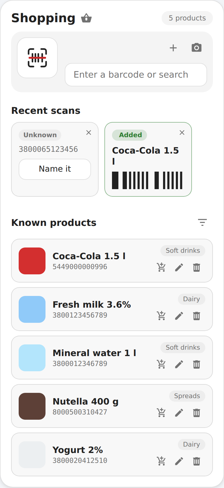
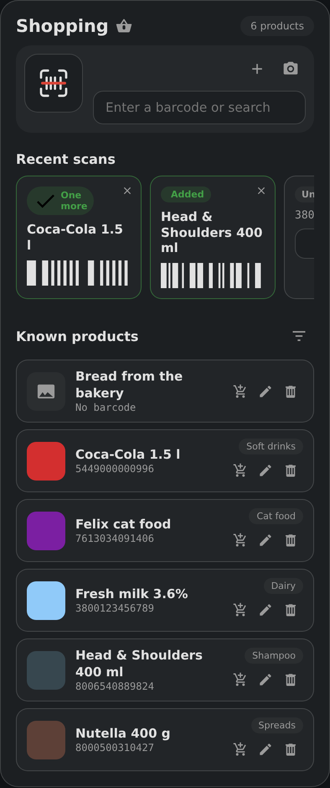

# HomeBasket Card

The dashboard card for the [HomeBasket](https://github.com/ivan1mihaylov/HomeBasket)
Home Assistant integration. Scan a barcode with your phone camera, or type it
in, and the product goes onto your shopping list.

<p>
  
  
</p>

The card is written against plain DOM APIs on purpose. It uses **no Home
Assistant frontend internals** — no `ha-textfield`, no `ha-dialog`, no Lit — so
a rename inside the Home Assistant frontend cannot leave you with an invisible
input field or a missing button. It ships as a single file, so there are no
sub-modules that can get stuck in a browser cache.

## Requirements

The [HomeBasket integration](https://github.com/ivan1mihaylov/HomeBasket) has
to be installed and configured first — the card talks to it over the Home
Assistant WebSocket API.

## Installation

### HACS (custom repository)

1. HACS → ⋮ → **Custom repositories**
2. URL `https://github.com/ivan1mihaylov/HomeBasket-Card`, type **Dashboard**
3. Install **HomeBasket Card**
4. Add the card to a dashboard: **Add card → HomeBasket**

### Manual

Copy `dist/homebasket-card.js` to `config/www/homebasket/homebasket-card.js`
and register it under **Settings → Dashboards → Resources**:

```
URL:  /local/homebasket/homebasket-card.js?v=0.1.0
Type: JavaScript Module
```

Bump the `?v=` value whenever you edit the file, otherwise the browser and the
companion app will keep serving the cached copy.

## Configuration

```yaml
type: custom:homebasket-card
title: Shopping
```

| Option | Default | Description |
| --- | --- | --- |
| `title` | translated | Card heading. |
| `language` | Home Assistant's | `bg` or `en`. Leave empty to follow the Home Assistant language. |
| `add_on_scan` | `true` | Put recognised products on the shopping list immediately. Turn off to only build the product dictionary. |
| `open_known` | `false` | Turn on to open the product when a barcode HomeBasket already knows is scanned, so it can be corrected on the spot. Off, a known barcode is scanned onto the list without interrupting. |
| `scan_on_open` | `false` | Open the camera as soon as the card is shown. For a card on its own view — see the home screen shortcut below. |
| `show_recent` | `true` | Show the strip of recent scans and codes waiting for a name. |
| `show_products` | `true` | Show the list of learned products. |
| `zxing_url` | `null` | Only for browsers without a built-in barcode detector — see below. |

All options are also editable in the visual card editor. The interface is
translated into English and Bulgarian.

## Product photos

Products are shown with a picture wherever one is available:

- **Automatically** — the integration stores the product image Open Food Facts
  returns, and the card loads it from there.
- **Your own** — tap a product's thumbnail (or the pencil) and press the square
  camera button. On a phone that opens the camera; on a desktop it opens the
  file picker. The photo is scaled down in the browser before it is sent, and
  Home Assistant keeps it in its own storage — it is never served from a
  public path.

The picture replaces the button once there is one; the ✕ in its corner clears
it and brings the button back. Nothing is written until you press **Save**, so
you can back out of any change with **Cancel**.

**Look up again**, at the bottom of the sheet, re-queries Open Food Facts and
refills the name, category and picture — useful when a product has been
improved in the database since you first scanned it, or after you renamed it by
hand and want the original back. It only fills the fields in; the save still
has to be confirmed.

## More than one barcode per product

The same yoghurt in a 400 g and a 900 g tub carries two barcodes but is one
line on a shopping list. Scanning either one resolves to the same product, and
editing it through either barcode edits the same entry.

When a scan creates a product that resembles one you already have, the sheet
opens with the look-alikes listed at the bottom. Pick one and the scanned
barcode joins it; ignore them and you get two separate products. A scan with
nothing similar in the list never opens anything — it stays the one-beep path.

Matching compares the words of the name and brand, ignoring sizes, and weighs
each word by how many products already use it: in a fridge full of "мляко
Верея", what identifies a product is "кисело". So a 900 g tub finds the 400 g
one without matching every other dairy item.

The edit sheet lists a product's barcodes, each detachable except the first.

## Product details

Tapping a product's name opens everything Open Food Facts knows about it:
Nutri-Score, NOVA and Eco-Score, the nutrition table per 100 g, the ingredient
list, allergens, labels, packaging, origin and where it is sold, with a link to
the product's page on Open Food Facts.

The record is fetched once, when the barcode is first scanned, and kept by the
integration — opening a product reads that stored copy and makes no network
request. **Look up again**, in both the details sheet and the edit sheet, is the
only thing that goes back out to Open Food Facts.

## How a scan flows

```
        type or scan a barcode
                  │
                  ▼
        known ──yes──▶ product name ──▶ shopping list
          │ no
          ▼
   Open Food Facts ──found──▶ remembered ──▶ shopping list
          │ not found
          ▼
   the card asks you for a name, then remembers it
```

The second scan of the same product never asks again — it goes straight to the
list, offline, and lands in the recent strip, so one product after another can
be scanned without stopping. Turn `open_known` on to have each known product
open for editing instead.

The same barcode read as UPC-A (twelve digits) and as EAN-13 (the same digits
with a leading zero) is one product, whichever reading your scanner reports.

## A shortcut on the phone's home screen

One tap from the home screen to the camera, without going through the app:

1. Make a dashboard view holding only this card, with `scan_on_open: true`.
   Opening the view is then the same as opening the camera.
2. Point a home screen shortcut at that view:
   - **Android** — Companion app → Settings → Companion app → Manage shortcuts
     → add one with the view's path (`/lovelace/scan`), then long-press the
     Home Assistant icon on the home screen and drag the shortcut out.
   - **iOS** — Shortcuts app → new shortcut → *Open URL* with
     `homeassistant://navigate/lovelace/scan` → share it to the home screen.

A dashboard you use for other things works too: put `?homebasket=scan` on the
end of the shortcut's path and the card opens the camera once, on arrival.

If the browser refuses the camera because nothing on the page was tapped, the
dialog says so and offers a button to open it — one tap instead of none.

## Camera support

The camera uses the browser's built-in `BarcodeDetector`, which is available in
Chrome, Edge and the **Android** Home Assistant Companion app. Two things are
required for it to work at all:

- an **HTTPS** connection (Nabu Casa, a reverse proxy, or a local certificate);
- camera permission for Home Assistant.

**Safari and iOS** have no `BarcodeDetector`. You can either type the code in,
use a hardware scanner, or point the card at a ZXing build you host yourself:

```yaml
type: custom:homebasket-card
zxing_url: /local/homebasket/zxing.min.js
```

Nothing is loaded from a third party unless you set that option.

## License

[MIT](LICENSE)
